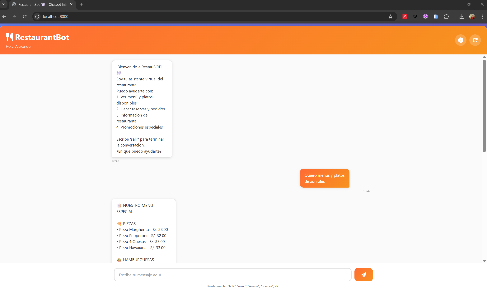

# RestaurantBot 🍽️ - Chatbot Inteligente para Restaurante



## 📋 Descripción

RestaurantBot es un chatbot basado en reglas diseñado para asistentes virtuales en restaurantes. Implementado en Python, permite manejar:

- 📋 **Consulta de menú y realización de pedidos**
- 📅 **Gestión de reservas de mesas**
- ℹ️ **Información del restaurante** (horarios, ubicación, promociones)

## 📁 Archivos del Proyecto

```
sesion1/
├── main.py                     # Aplicación FastAPI
├── restaurant_bot.py           # Código del chatbot
├── flujos_conversacion.json    # Mensajes y flujos
├── test_chatbot.py             # Tests unitarios
├── requirements.txt            # Dependencias
├── README_CHATBOT.md           # Este archivo
└── static/
    ├── index.html              # Página web
    ├── style.css               # Estilos
    └── script.js               # Lógica del cliente
```

## 🚀 Requisitos Previos

- **Python 3.8+**
- FastAPI (para la interfaz web)
- Uvicorn (servidor ASGI)

## 🛠️ Instalación

### Opción 1: Con entorno virtual (Recomendado) ⭐

```bash
# Navegar a la carpeta del proyecto
cd RestaurantBot

# Crear entorno virtual
python -m venv venv

# Activar entorno (Windows)
venv\Scripts\activate

# Activar entorno (Mac/Linux)
source venv/bin/activate

# Instalar dependencias
pip install -r requirements.txt
```

### Opción 2: Script automático (Windows)

```bash
ejecutar.bat
```

### Opción 3: Script automático (Mac/Linux)

```bash
chmod +x ejecutar.sh
./ejecutar.sh
```

## 🎮 Cómo Usar

### Opción 1: Interfaz Web con FastAPI ⭐ (Recomendado)

```bash
# Desde la carpeta del proyecto (con entorno virtual activado)
python main.py

# La aplicación se abrirá en:
# 🌐 http://localhost:8000
# 📚 Documentación: http://localhost:8000/docs
```

### Opción 2: Terminal/Consola (solo chatbot)

```bash
# Desde la carpeta del proyecto
python restaurant_bot.py

# O desde cualquier ubicación
python "C:\ruta\completa\RestaurantBot\restaurant_bot.py"
```

### Interacción Ejemplo

```
RestaurantBot - Tu Asistente Virtual
============================================================

¡Bienvenido a RestauBOT! 🍽️
Soy tu asistente virtual del restaurante.
Puedo ayudarte con:
  1. Ver menú y platos disponibles
  2. Hacer reservas y pedidos
  3. Información del restaurante
  4. Promociones especiales

Escribe 'salir' para terminar la conversación.
¿En qué puedo ayudarte?

------------------------------------------------------------

🧑 Tú: Hola, ¿tienen pizza?

🤖 RestauBot: 🍕 Nuestras pizzas son artesanales...
[Respuesta del bot]

------------------------------------------------------------

🧑 Tú: Dame una Margherita

🤖 RestauBot: ¡Perfecto! Tu pedido ha sido registrado.
[Confirmación de pedido]
```

## 🌐 API REST con FastAPI

RestaurantBot incluye una API REST moderna con documentación automática.

### Endpoints principales

#### Chat
- `GET /api/inicio` - Obtiene mensaje de bienvenida
- `POST /api/chat` - Envía mensaje y obtiene respuesta
- `GET /api/historial` - Obtiene historial completo
- `GET /api/estadisticas` - Obtiene estadísticas

#### Información
- `GET /api/menu` - Información del menú
- `GET /api/info` - Información del restaurante
- `GET /api/config` - Configuración del bot

#### Control
- `POST /api/reiniciar` - Reinicia la conversación
- `GET /health` - Verifica salud de la API

### Documentación Interactiva

Una vez ejecutando FastAPI:

```
http://localhost:8000/docs          # Swagger UI (recomendado)
http://localhost:8000/redoc         # ReDoc
```

### Ejemplo de Uso con cURL

```bash
# Enviar un mensaje
curl -X POST "http://localhost:8000/api/chat" \
  -H "Content-Type: application/json" \
  -d '{"texto": "Hola, quiero una pizza"}'

# Obtener historial
curl "http://localhost:8000/api/historial"

# Obtener información
curl "http://localhost:8000/api/info"
```

## 📚 Flujos de Conversación

### 1. **Flujo de Menú y Pedidos**

Permite al usuario:
- Consultar el menú completo
- Pedir platos específicos (pizzas, hamburguesas, pastas, ensaladas, postres)
- Agregar bebidas
- Confirmar o cancelar pedidos

**Palabras clave:** menu, pizza, hamburguesa, pasta, bebida, postre

### 2. **Flujo de Reservas**

Permite al usuario:
- Hacer una nueva reserva
- Modificar una reserva existente
- Cancelar una reserva

**Palabras clave:** reserva, reservar, agendar, fecha, hora

### 3. **Flujo de Información del Restaurante**

Proporciona información sobre:
- ⏰ Horarios de atención
- 📍 Ubicación y dirección
- 🏢 Características del ambiente
- 💳 Métodos de pago
- 🎉 Promociones especiales
- 📄 Facturación
- 📶 WiFi y servicios

**Palabras clave:** horario, ubicación, pago, promoción, wifi

## 📋 Menú del Restaurante

### Pizzas
- Pizza Margherita - S/. 28.00
- Pizza Pepperoni - S/. 32.00
- Pizza 4 Quesos - S/. 35.00
- Pizza Hawaiana - S/. 33.00

### Hamburguesas
- Burger Clásica - S/. 22.00
- Burger Premium (res) - S/. 28.00
- Burger Pollo Crujiente - S/. 24.00
- Burger Doble Queso - S/. 30.00

### Pastas
- Spaghetti a la Bolognesa - S/. 26.00
- Penne Alfredo - S/. 27.00
- Ravioles de Ricotta - S/. 28.00

### Ensaladas
- Ensalada César - S/. 18.00
- Ensalada Fresca - S/. 16.00
- Ensalada Caprese - S/. 20.00

### Postres
- Tiramisú - S/. 12.00
- Brownie Chocolate - S/. 10.00
- Cheesecake - S/. 14.00

### Bebidas
- Refrescos - S/. 5.00
- Jugo Natural - S/. 7.00
- Cerveza - S/. 8.00
- Vino - S/. 25.00

## 🎯 Tecnología y Arquitectura

### Componentes Principales

1. **RestaurantBot**: Clase principal que maneja la lógica del chatbot
2. **Normalización de Texto**: Convierte entrada a minúsculas, elimina tildes y caracteres especiales
3. **Búsqueda de Intenciones**: Usa similitud de texto (difflib) para encontrar la mejor coincidencia
4. **Gestión de Contexto**: Mantiene estado de la conversación

### Umbral de Similitud

- **Default**: 0.6 (60%)
- Se puede ajustar en `flujos_restaurante.json`

### Librerías Utilizadas

Todas son de la librería estándar de Python:
- `json`: Carga de configuración
- `re`: Expresiones regulares
- `difflib`: Cálculo de similitud
- `unicodedata`: Normalización de caracteres
- `random`: Selección aleatoria de respuestas
- `pathlib`: Manejo de rutas
- `sys`: Configuración del sistema

## 🧪 Testing

### Ejecutar Tests

```bash
# Ejecutar todos los tests
python test_restaurant_bot.py

# Con unittest
python -m unittest test_restaurant_bot -v

# Con pytest (si está instalado)
pytest test_restaurant_bot.py -v
```

### Cobertura de Tests

Los tests cubren:
- ✅ Carga de flujos
- ✅ Normalización de texto
- ✅ Cálculo de similitud
- ✅ Respuestas a diferentes categorías
- ✅ Manejo de entradas inválidas
- ✅ Historial de conversación
- ✅ Conversaciones completas integradas

## ⚙️ Configuración

### Ajustes en `flujos_restaurante.json`

```json
{
  "configuracion": {
    "umbral_similitud": 0.6,           // Sensibilidad de búsqueda
    "nombre_restaurante": "RestauBOT",
    "mensaje_bienvenida": "...",       // Mensaje inicial
    "mensaje_despedida": "...",        // Mensaje de cierre
    "mensaje_no_entendido": "..."      // Respuesta por defecto
  }
}
```

### Agregar Nuevos Patrones

1. Editar `flujos_restaurante.json`
2. Agregar palabras clave en el array `patrones`
3. El chatbot detectará automáticamente

Ejemplo:
```json
{
  "id": "nuevo_patron",
  "patrones": [
    "palabra1",
    "palabra2",
    "palabra3"
  ],
  "respuestas": [
    "Tu respuesta aquí"
  ]
}
```

## 🔧 Desarrolladores

### Extensiones Posibles

- Integración con base de datos
- Procesamiento de lenguaje natural (NLP) con NLTK/spaCy
- APIs para integración con sistemas de reservas
- WebSocket para interfaz web
- Integración con Telegram/WhatsApp
- Almacenamiento de historial en BD
- Sistema de feedback de usuarios

### Estructura de Intención

```python
{
  "id": "identificador_unico",
  "patrones": ["palabra1", "palabra2"],
  "respuestas": ["respuesta1", "respuesta2"],
  "siguiente_sugerencia": "sugerencia para el usuario",
  "accion_especial": "terminar"  # Opcional
}
```

## 📊 Uso Programático

```python
from restaurant_bot import RestaurantBot

# Crear instancia del bot
bot = RestaurantBot('flujos_restaurante.json')

# Procesar entrada del usuario
respuesta, debe_terminar = bot.procesar_entrada("hola")
print(respuesta)

# Obtener historial
historial = bot.obtener_historial()

# Obtener estadísticas
stats = bot.obtener_estadisticas()
print(f"Total mensajes: {stats['total_mensajes']}")
```

## 📝 Notas de Desarrollo

- **Encoding**: El script configura UTF-8 automáticamente en Windows
- **Performance**: Rápido incluso con muchos patrones (búsqueda lineal optimizada)
- **Escalabilidad**: Fácil de agregar nuevos flujos y patrones
- **Mantenibilidad**: Configuración separada del código (JSON)

## 🐛 Troubleshooting

### Problema: "No se encontró el archivo flujos_restaurante.json"

**Solución**: Asegúrate de estar en la carpeta correcta del proyecto

```bash
cd RestaurantBot
python restaurant_bot.py
```

### Problema: Caracteres especiales no se muestran bien

**Solución**: El script configura UTF-8 automáticamente. Si persiste:

```bash
# En Windows PowerShell
chcp 65001
python restaurant_bot.py

# En CMD
chcp 65001
python restaurant_bot.py
```

### Problema: Los tests no corren

```bash
# Asegúrate de tener unittest disponible (está en stdlib)
python -m unittest test_restaurant_bot -v
```

## 📞 Información de Contacto

**RestauBOT - Restaurante Inteligente**
- 📍 Avenida Principal 450, Miraflores, Lima
- 📱 +51 1 2345678
- 📧 info@restaubot.pe

## 📄 Licencia

Este proyecto es parte del curso de Diseño e Implementación de Chatbots.

## 👨‍🏫 Créditos

Basado en la arquitectura de chatbots de la Sesión 1 del curso de Diseño e Implementación de Chatbots.

---

**Versión:** 1.0  
**Última actualización:** Enero 2026  
**Estado:** ✅ Funcional y listo para producción
